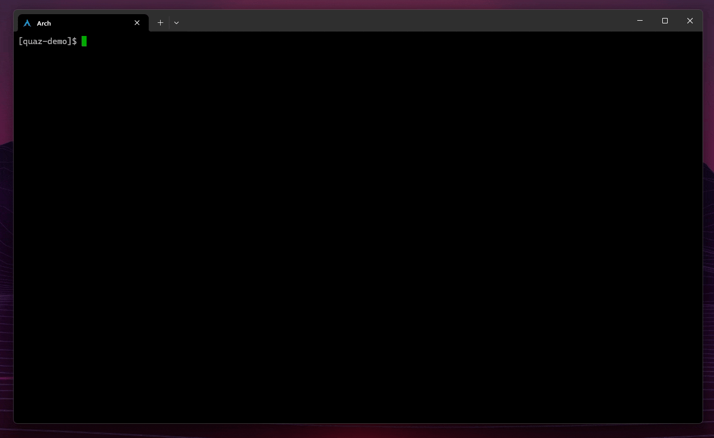

# Git Quick AssetZ (quaz)
A TUI [(tview)](https://github.com/rivo/tview) tool written in Go for downloading assets from git releases with ease.

# Why?
I needed a tool with a user-friendly UI to quickly hand pick and download specific assets from
releases of tool repository when working on CTF/HTB challenges.

> [!Note]
> `quaz` only displays the non-default assets for each release. In other words, source `zip` and `tar.gz` files are not shown. This is intended behavior, because downloading them are no different to cloning the repository.

# Build and run
Install using `go` ($GOPATH must be in your environment variables in order to use `quaz` from everywhere):

```console
go install github.com/ArmanHZ/git-quick-assetz/cmd/quaz@latest
```

To build and run, you can use the `build_and_run.sh` or manually as follows:

```console
git clone https://github.com/ArmanHZ/git-quick-assetz.git
go build -o ./quaz ./cmd/quaz/quaz.go
./quaz
```

If you want, you can move the `quaz` to somewhere that is in your path and use it
from anywhere you want.

# Usage
- The movement keys for switching componentgs, eg. buttons, are `Tab` and `Shift+Tab`.
- Moving within the components, eg. navigating through a list, `arrow keys` or `j/k` keys work.
- The action key is `Enter`, eg. after you input your URL, hit `enter` to pull the asset list.
- Everytime you pull the assets of a repo, the URL gets saved in this file: `$HOME/.config/quaz/hist.json`.
  - This allows you to press `ctrl+f` when the __url input__ is in focus to quickly re-use the previously navigated repos.
- By default, your current working directory will be shown in the `Save location` input field.
- If you don't want to type the path manually, you can just launch `quaz` in the directory that you want to download the assets into.

# Screenshots and functionalities
With the default color scheme of `Windows Terminal`, the TUI app looks like this:



