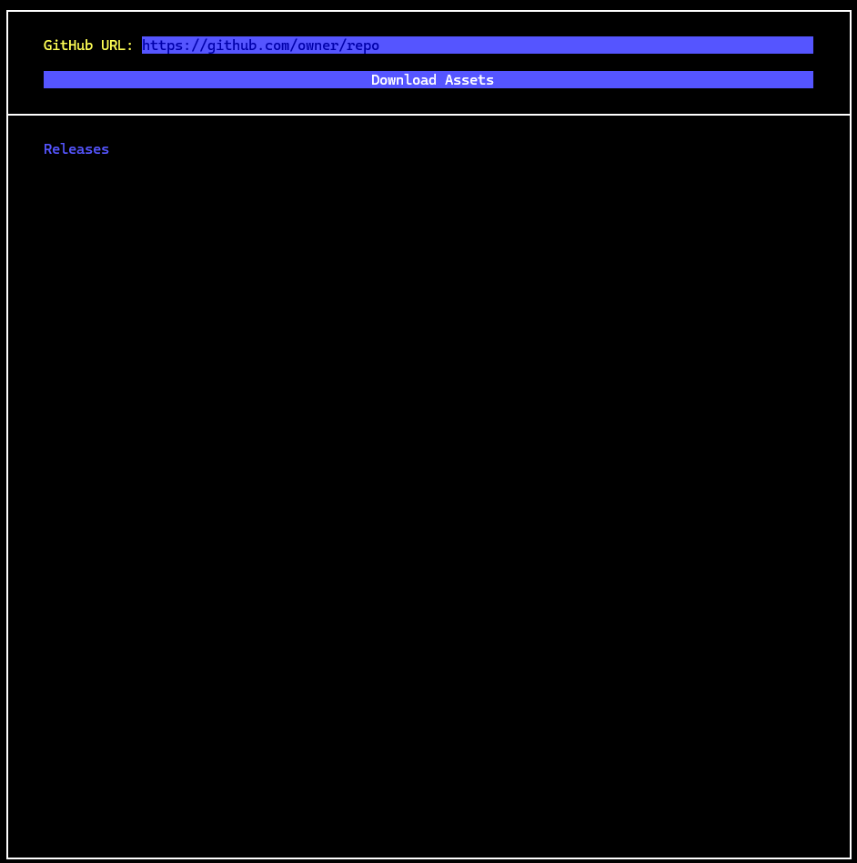
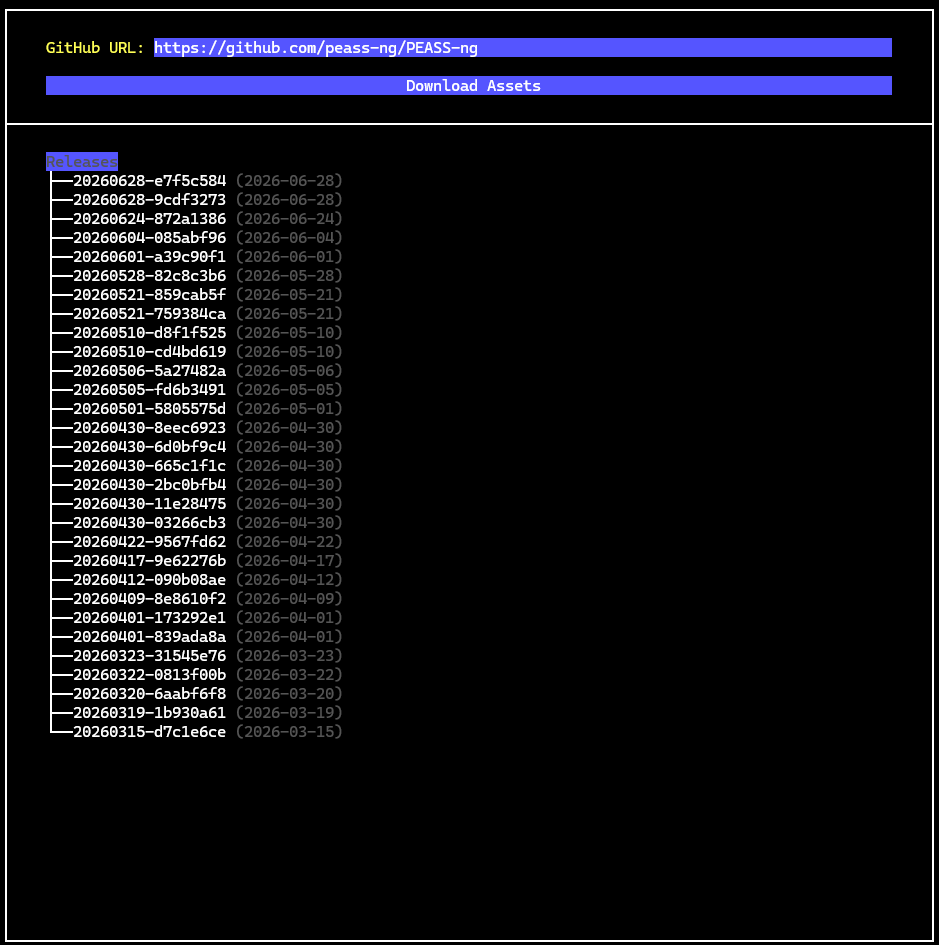
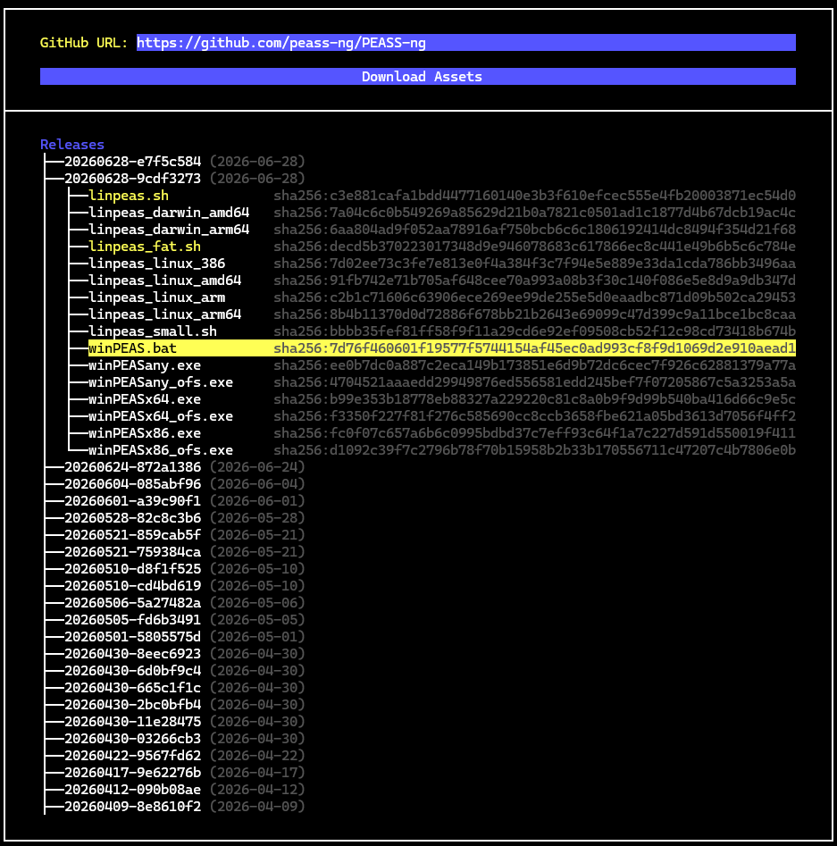
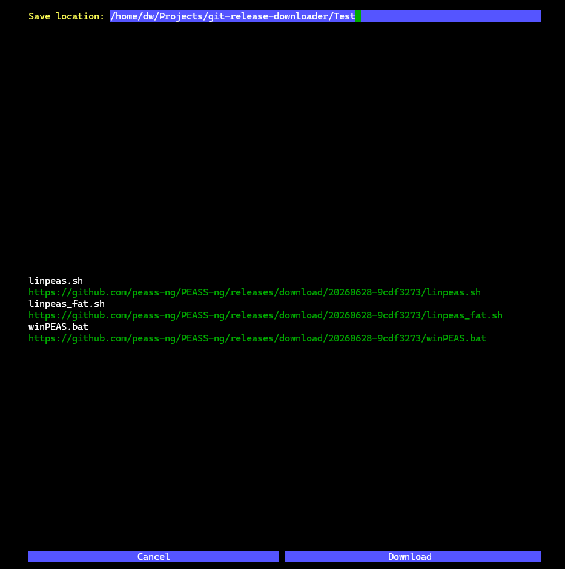

# git-release-downloader
A tool written in Go to download Git releases with ease.

# Why?
I needed a tool with a user-friendly UI to quickly download the latest releases of
pentesting tools when solving CTF/HTB challenges, so I wrote this TUI tool.

# Build and run
As of now, you can't use `go get` to download this, but I will add this later.

To build and run, you can use the `build_and_run.sh` or manually as follows:

```bash
git clone https://github.com/ArmanHZ/git-release-downloader.git

go build -o ./grd ./cmd/grd/grd.go

./grd
```

If you want, you can move the `grd` to somewhere that is in your path and use it
from anywhere you want.

# Usage
The movement keys are `Tab` and `Shift+Tab`.

The action key is `Enter`.

# Screenshots and functionalities
With the default color scheme of `Windows Terminal`, the TUI app looks like this:



You can enter/paste a valid `GitHub` URL in the text box and press `enter` to pull
all available releases:



You can navigate to the release you want, expand it and select the files you want:



After that, you can press the `Download Assets` button to see the assets that will
be downloaded and as well as the ability to define a directory where they will be
downloaded to.



By default, your current working directory will be shown in the `Save location`
input field.
